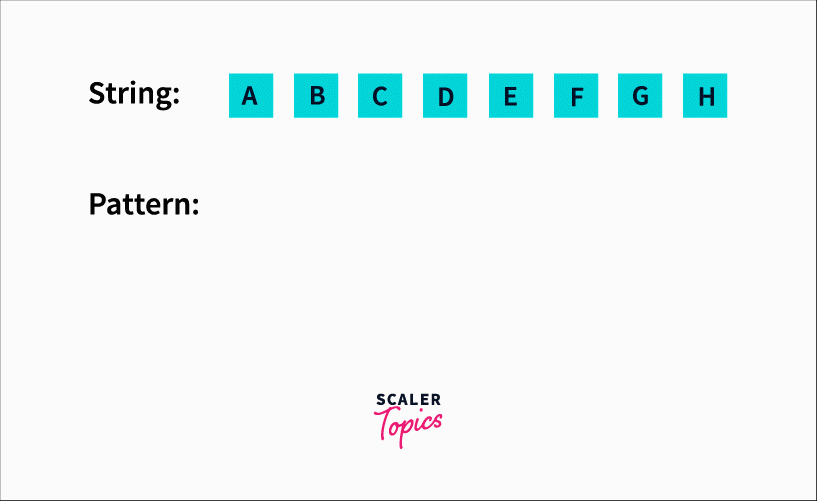

<html lang="en">
<head>
<meta charset="UTF-8" />
<meta name="viewport" content="width=device-width, initial-scale=1" />

</head>
<body>

<h1>🌐 Query Matching in Search Engines</h1>

<h3>1. 🧠 Rabin-Karp and KMP</h3>

Okay, so I've been digging into how search engines like Google actually match queries super fast, and I found that two algorithms — Rabin-Karp and KMP — play a huge role in making keyword search efficient. Let me walk you through what I learned.

<h2>📌 i. Rabin-Karp</h2>

So, Rabin-Karp is this clever idea where instead of comparing every character one by one to find a pattern in text, it uses something called a rolling hash. At first, I thought, how does hashing help with string matching? But then it clicked — instead of matching characters all the time, it compares hash values of the pattern and substrings in the text. When the hashes match, it double-checks character-by-character to confirm.

That way, it’s like scanning a whole text with a magnifying glass that only zooms in when something looks promising.

Here’s the code I played around with:

<pre><code class="language-cpp">
#include &lt;iostream&gt;
using namespace std;

const int d = 256;  // ASCII alphabet size
const int q = 101;  // Prime number for mod hashing

void rabinKarp(string txt, string pat) {
    int M = pat.length(), N = txt.length();
    int p = 0, t = 0, h = 1;

    for (int i = 0; i &lt; M - 1; i++)
        h = (h * d) % q;

    for (int i = 0; i &lt; M; i++) {
        p = (d * p + pat[i]) % q;
        t = (d * t + txt[i]) % q;
    }

    for (int i = 0; i &lt;= N - M; i++) {
        if (p == t) {
            bool match = true;
            for (int j = 0; j &lt; M; j++)
                if (txt[i + j] != pat[j]) match = false;
            if (match)
                cout &lt;&lt; "Pattern found at index " &lt;&lt; i &lt;&lt; endl;
        }
        if (i &lt; N - M) {
            t = (d * (t - txt[i] * h) + txt[i + M]) % q;
            if (t &lt; 0) t += q;
        }
    }
}
</code></pre>

What really surprised me is how the rolling hash updates the hash for the next substring in constant time by subtracting the outgoing char’s contribution and adding the incoming char. It’s such an elegant trick!

<h3>🌎 The Algo, My Way</h3>

Here's a visual demonstration of how Rabin-Karp works:

<h3>⏱️ Time &amp; Space Complexity - Rabin-Karp</h3>
<ul>
  <li><strong>Best/Average Case</strong>: O(N + M)</li>
  <li><strong>Worst Case</strong>: O(N*M) (if many hash collisions occur)</li>
  <li><strong>Space Complexity</strong>: O(1)</li>
</ul>

<h2>📌 ii. KMP (Knuth-Morris-Pratt)</h2>

Next, I explored KMP, which seemed more complex but equally brilliant. The main idea is: instead of blindly restarting the search from scratch after a mismatch, KMP preprocesses the pattern to build an LPS (Longest Prefix Suffix) array. This array tells the algorithm how far back to jump in the pattern without rechecking already matched characters.

When I looked at the LPS computation, I realized it’s basically mapping the pattern’s internal structure, like a cheat sheet for future mismatches.

Here’s the code I studied:

<pre><code class="language-cpp">
#include &lt;iostream&gt;
#include &lt;vector&gt;
using namespace std;

// Preprocess the pattern to create LPS array
void computeLPS(string pat, vector&lt;int&gt;&amp; lps) {
    int len = 0, i = 1;
    lps[0] = 0;

    while (i &lt; pat.size()) {
        if (pat[i] == pat[len]) {
            lps[i++] = ++len;
        } else {
            if (len != 0) len = lps[len - 1];
            else lps[i++] = 0;
        }
    }
}

// Main KMP pattern matching function
void KMPSearch(string txt, string pat) {
    int M = pat.size(), N = txt.size();
    vector&lt;int&gt; lps(M);
    computeLPS(pat, lps);

    int i = 0, j = 0;
    while (i &lt; N) {
        if (pat[j] == txt[i]) {
            i++; j++;
        }

        if (j == M) {
            cout &lt;&lt; "Pattern found at index " &lt;&lt; i - j &lt;&lt; endl;
            j = lps[j - 1];
        } else if (i &lt; N &amp;&amp; pat[j] != txt[i]) {
            if (j != 0)
                j = lps[j - 1];
            else
                i++;
        }
    }
}
</code></pre>

<h3>🌎 The Algo, My Way</h3>

Here's a visual demonstration of how KMP works:

<h3>⏱️ Time &amp; Space Complexity - KMP</h3>
<ul>
  <li><strong>Time Complexity</strong>: O(N + M)</li>
  <li><strong>Space Complexity</strong>: O(M) (for LPS array)</li>
</ul>

<h2>🔄 Comparison: Rabin-Karp vs KMP</h2>

<table border="1" cellpadding="5" cellspacing="0">
  <thead>
    <tr>
      <th>Feature</th>
      <th>Rabin-Karp</th>
      <th>KMP</th>
    </tr>
  </thead>
  <tbody>
    <tr>
      <td><strong>Technique</strong></td>
      <td>Rolling Hash</td>
      <td>LPS Preprocessing</td>
    </tr>
    <tr>
      <td><strong>Best Case</strong></td>
      <td>O(N + M)</td>
      <td>O(N + M)</td>
    </tr>
    <tr>
      <td><strong>Worst Case</strong></td>
      <td>O(N*M) (collisions)</td>
      <td>O(N + M)</td>
    </tr>
    <tr>
      <td><strong>Space</strong></td>
      <td>O(1)</td>
      <td>O(M)</td>
    </tr>
    <tr>
      <td><strong>Handles Multiple Patterns?</strong></td>
      <td>Yes (efficiently)</td>
      <td>No (needs separate runs)</td>
    </tr>
    <tr>
      <td><strong>Use Case</strong></td>
      <td>Plagiarism, search engines</td>
      <td>Streaming search, logs</td>
    </tr>
  </tbody>
</table>

<h3>✅ When to Use Which?</h3>
<ul>
  <li><strong>Rabin-Karp</strong> is better when you need to <strong>search multiple patterns</strong> or focus on <strong>hash-based matching</strong> (like plagiarism checkers).</li>
  <li><strong>KMP</strong> is better when searching for <strong>single patterns with repetitive structure</strong> and you want guaranteed linear time</li>
</ul>

</body>
</html>
