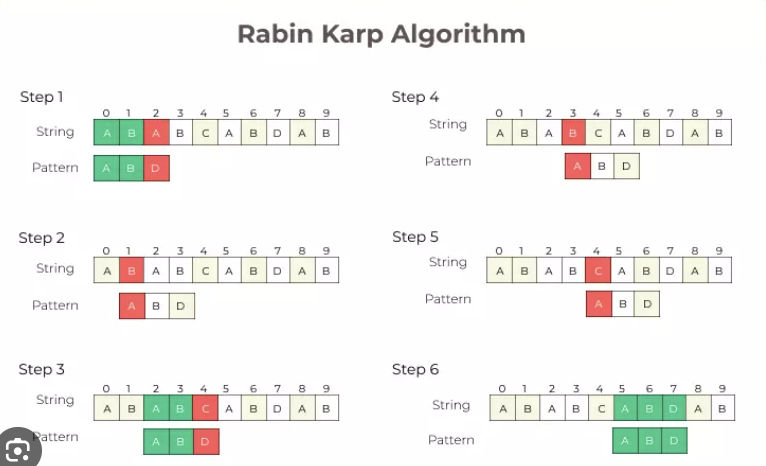
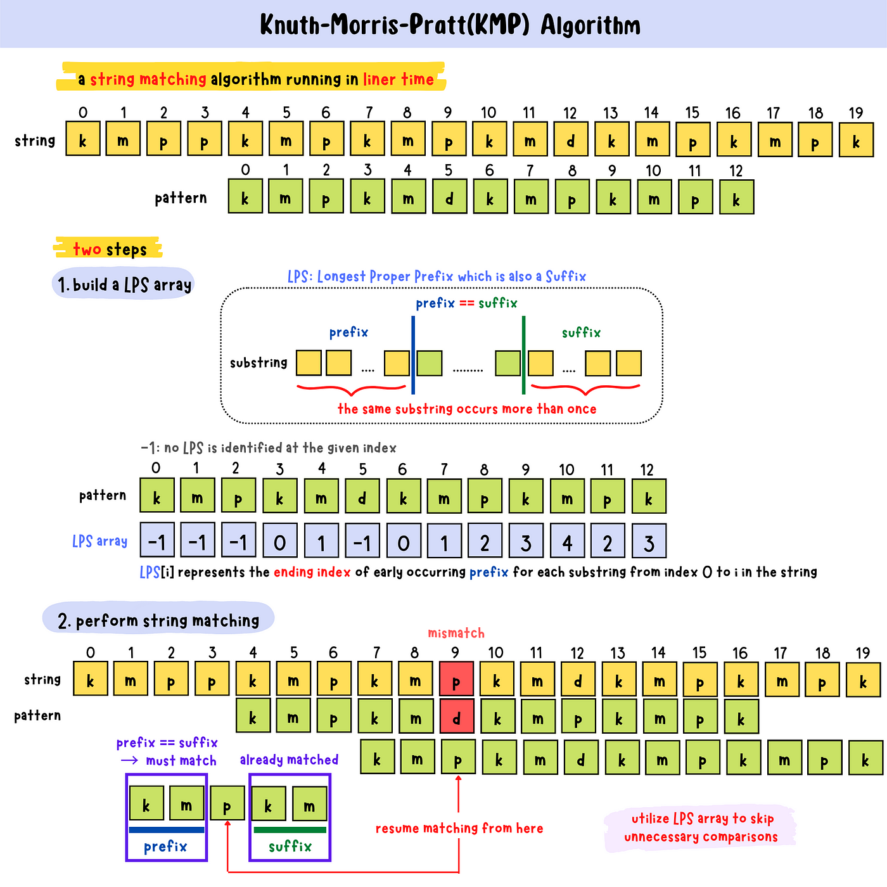

# 🌐 Query Matching in Search Engines

### 1. 🧠 Rabin-Karp and KMP
These algorithms are crucial in Google’s search backend, enabling rapid and efficient keyword query matching across massive datasets.


## 📌 i. Rabin-Karp  
Used to search a pattern in a text using **rolling hash**. It checks hashes of substrings instead of characters one-by-one, improving speed for basic matching.

📍 **Used in**: Search engines for spam detection, keyword matching, plagiarism checkers, etc.


```cpp
#include <iostream>
using namespace std;

const int d = 256;  // ASCII alphabet size
const int q = 101;  // Prime number for mod hashing

void rabinKarp(string txt, string pat) {
    int M = pat.length(), N = txt.length();
    int p = 0, t = 0, h = 1;

    for (int i = 0; i < M - 1; i++)
        h = (h * d) % q;

    for (int i = 0; i < M; i++) {
        p = (d * p + pat[i]) % q;
        t = (d * t + txt[i]) % q;
    }

    for (int i = 0; i <= N - M; i++) {
        if (p == t) {
            bool match = true;
            for (int j = 0; j < M; j++)
                if (txt[i + j] != pat[j]) match = false;
            if (match)
                cout << "Pattern found at index " << i << endl;
        }
        if (i < N - M) {
            t = (d * (t - txt[i] * h) + txt[i + M]) % q;
            if (t < 0) t += q;
        }
    }
}
```

### 🌎 Architecture

- Think of Rabin-Karp as a **sliding window** scanning the text.
- It computes a hash for the pattern and compares it with hashes of substrings in the text.
- If a hash match is found, it does a **character-by-character check** to confirm.



### ⏱️ Time & Space Complexity - Rabin-Karp
- **Best/Average Case**: O(N + M)
- **Worst Case**: O(N*M) (if many hash collisions occur)
- **Space Complexity**: O(1)

---

## 📌 ii. KMP (Knuth-Morris-Pratt)  
Avoids repeated scans of the same characters by pre-processing the pattern into an LPS (Longest Prefix Suffix) array.

📍 **Used in**: Google Search to match queries in text corpus, logs, or real-time streaming data.


```cpp
#include <iostream>
#include <vector>
using namespace std;

// Preprocess the pattern to create LPS array
void computeLPS(string pat, vector<int>& lps) {
    int len = 0, i = 1;
    lps[0] = 0;

    while (i < pat.size()) {
        if (pat[i] == pat[len]) {
            lps[i++] = ++len;
        } else {
            if (len != 0) len = lps[len - 1];
            else lps[i++] = 0;
        }
    }
}

// Main KMP pattern matching function
void KMPSearch(string txt, string pat) {
    int M = pat.size(), N = txt.size();
    vector<int> lps(M);
    computeLPS(pat, lps);

    int i = 0, j = 0;
    while (i < N) {
        if (pat[j] == txt[i]) {
            i++; j++;
        }

        if (j == M) {
            cout << "Pattern found at index " << i - j << endl;
            j = lps[j - 1];
        } else if (i < N && pat[j] != txt[i]) {
            if (j != 0)
                j = lps[j - 1];
            else
                i++;
        }
    }
}
```

### 🌎 Architecture 

- The KMP algorithm uses the **LPS array** to skip unnecessary comparisons.
- It avoids re-evaluating prefixes that are already matched.



### ⏱️ Time & Space Complexity - KMP
- **Time Complexity**: O(N + M)
- **Space Complexity**: O(M) (for LPS array)

---

## 🔄 Comparison: Rabin-Karp vs KMP

| Feature              | Rabin-Karp            | KMP                      |
|---------------------|------------------------|---------------------------|
| **Technique**        | Rolling Hash           | LPS Preprocessing         |
| **Best Case**        | O(N + M)               | O(N + M)                  |
| **Worst Case**       | O(N*M) (collisions)    | O(N + M)                  |
| **Space**            | O(1)                   | O(M)                      |
| **Handles Multiple Patterns?** | Yes (efficiently) | No (needs separate runs) |
| **Use Case**         | Plagiarism, search engines | Streaming search, logs |

### ✅ When to Use Which?
- **Rabin-Karp** is better when you need to **search multiple patterns** or focus on **hash-based matching** (like plagiarism checkers).
- **KMP** is better when searching for **single patterns with repetitive structure** and you want guaranteed linear time.

---
