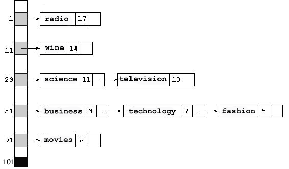

## 🔁 Step 4: Managing Recurring Events

### 1. 🔄 Handling Repeating Schedules with Linked Structures  
Recurring meetings in Google Calendar aren't just stored again and again — they’re **efficiently managed using data structures like Linked Lists, Hash Maps**, and even **Cycle Detection algorithms**.

Let’s explore how this logic flows 👇

---

## 📌 i. Linked Lists for Event Chaining  
A **linked list** can represent events connected in a repeat cycle. Each node contains the event and a pointer to the next occurrence.

- This way, editing one meeting updates the entire chain efficiently.  
- Especially useful when dealing with **weekly/monthly repeats**.

```cpp
// C++: Linked list node for recurring event
struct Event {
    string title;
    string datetime;
    Event* next;

    Event(string t, string dt) {
        title = t;
        datetime = dt;
        next = nullptr;
    }
};
```
### 🌎 The Algo, My Way


---

---

## 📌 ii. Detecting Infinite Loops with Floyd’s Cycle Algorithm  
To prevent bugs where events may link in an infinite cycle (e.g., misconfigured repeat rules), **Floyd’s Cycle Detection** (a.k.a. the Tortoise and Hare algorithm) is used.

```python
def has_cycle(head):
    slow = fast = head
    while fast and fast.next:
        slow = slow.next
        fast = fast.next.next
        if slow == fast:
            return True
    return False
```

- This ensures your calendar doesn’t go into an endless rendering loop.

---

## 📌 iii. Hash Maps for Fast Lookups  
Want to check if a recurring event exists on a specific date?  
Hash maps allow constant-time checking for **specific event instances**.

```python
# Python: Event lookup with hash map
calendar = {
    "2025-06-10": "DSA Review",
    "2025-06-17": "DSA Review"
}
print("DSA Review" in calendar.values())  # True
```

---

### 🌎 The Algo, My Way



---

### ⏱️ Time & Space Complexity

| Operation                     | Time Complexity | Space Complexity |
|------------------------------|------------------|------------------|
| Add recurring event (LL)     | O(1) per node    | O(n)             |
| Detect cycle (Floyd’s Algo)  | O(n)             | O(1)             |
| Hash map lookup              | O(1)             | O(n)             |

---

### ✅ Why Linked Structures?

- They're **lightweight** and ideal for **patterned repetition**.  
- Efficient for traversing and modifying **series of events**.  
- Work seamlessly with **cycle detection** to prevent calendar bugs.

