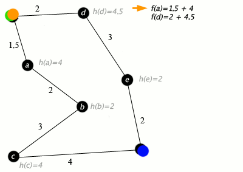

# 🚦 Step 2: Live Traffic Integration

Welcome! 👋 Get ready to uncover how traffic estimation works behind the scenes using powerful graph algorithms. We'll walk through three key methods step-by-step—just like you’d explore them hands-on! 🧪

---

## 📌 i. Exploring Dynamic Graphs

Think of dynamic graphs as road networks that **change over time**—a road opens, another closes, or maybe congestion causes delays.

Let's play with a dynamic graph using C++:

```cpp
#include <iostream>
#include <vector>
using namespace std;

class DynamicGraph {
    int V;
    vector<vector<int>> adjMatrix;
public:
    DynamicGraph(int vertices) : V(vertices) {
        adjMatrix.resize(V, vector<int>(V, 0));
    }

    void addEdge(int u, int v, int weight) {
        adjMatrix[u][v] = weight;
        adjMatrix[v][u] = weight;  // assuming undirected graph
    }

    void removeEdge(int u, int v) {
        adjMatrix[u][v] = 0;
        adjMatrix[v][u] = 0;
    }

    void printGraph() {
        cout << "Adjacency Matrix:\n";
        for (int i = 0; i < V; i++) {
            for (int j = 0; j < V; j++) {
                cout << adjMatrix[i][j] << " ";
            }
            cout << "\n";
        }
    }
};


```


---

### 🌎 The Algo, My Way  


---

## 📌 ii. A* Search in Real-Time 🚗💨

Time to speed up our routing using **A*** — an informed search that guesses the best path quickly using heuristics.

```cpp
#include <iostream>
#include <vector>
#include <queue>
#include <cmath>
#include <algorithm>
using namespace std;

struct Node {
    int vertex;
    double cost, heuristic;
    Node(int v, double c, double h) : vertex(v), cost(c), heuristic(h) {}
    bool operator<(const Node& other) const {
        return (cost + heuristic) > (other.cost + other.heuristic);
    }
};

double heuristic(int u, int v, vector<pair<int,int>>& coords) {
    return sqrt(pow(coords[u].first - coords[v].first, 2) + pow(coords[u].second - coords[v].second, 2));
}

vector<int> AStar(int start, int goal, vector<vector<pair<int,int>>>& graph, vector<pair<int,int>>& coords) {
    int n = graph.size();
    vector<double> dist(n, 1e9);
    vector<int> parent(n, -1);
    priority_queue<Node> pq;

    dist[start] = 0;
    pq.push(Node(start, 0, heuristic(start, goal, coords)));

    while (!pq.empty()) {
        Node curr = pq.top(); pq.pop();
        int u = curr.vertex;
        if (u == goal) break;

        for (auto& edge : graph[u]) {
            int v = edge.first;
            double w = edge.second;
            double tentative_g = dist[u] + w;
            if (tentative_g < dist[v]) {
                dist[v] = tentative_g;
                parent[v] = u;
                pq.push(Node(v, dist[v], heuristic(v, goal, coords)));
            }
        }
    }

    vector<int> path;
    if (dist[goal] == 1e9) return path;
    for (int at = goal; at != -1; at = parent[at]) path.push_back(at);
    reverse(path.begin(), path.end());
    return path;
}


```


---

### 🌎 The Algo, My Way  




---

## 📌 iii. Floyd-Warshall - Full Network Awareness 🌐

When you want to **analyze the whole map at once** — say, how long it takes between ANY two intersections — you turn to **Floyd-Warshall**.

```cpp
#include <iostream>
#include <vector>
#include <climits>
using namespace std;

// Solves the all-pairs shortest path
// problem using Floyd Warshall algorithm
void floydWarshall(vector<vector<int>> &dist) {
    int V = dist.size();

    // Add all vertices one by one to
    // the set of intermediate vertices.
    for (int k = 0; k < V; k++) {

        // Pick all vertices as source one by one
        for (int i = 0; i < V; i++) {

            // Pick all vertices as destination
            // for the above picked source
            for (int j = 0; j < V; j++) {

                // shortest path from
                // i to j 
                if(dist[i][k] != 1e8 && dist[k][j]!= 1e8)
                dist[i][j] = min(dist[i][j],dist[i][k] + dist[k][j]);
            }
        }
    }
}

```
---

### 🌎 The Algo, My Way  


---


## 🧮 Time & Space Complexity Summary

| Algorithm           | Time Complexity      | Space Complexity |
|---------------------|---------------------|------------------|
| Dynamic Graph Edits  | O(1) per update (adjacency matrix) | O(V²)           |
| Real-time A* Search  | O(E log V) (depends on heuristic) | O(V)            |
| Floyd-Warshall       | O(V³)               | O(V²)            |

---


## ✅ When to Use What?

- **Use Dynamic Graphs when:**
  - 🔁 Roads or traffic conditions change frequently (e.g., accidents, construction).
  - ➕ You need to add or remove edges dynamically in real-time.

- **Use A* Search when:**
  - 🚀 You want the fastest route between two points using smart guesses (heuristics).
  - 📍 Ideal for real-time applications like Google Maps or delivery services.

- **Use Floyd-Warshall when:**
  - 🌐 You need to compute shortest paths between all pairs of nodes.
  - 📊 Best for dense graphs or centralized traffic analysis systems.
  - 🏢 Useful for precomputing distance tables in control centers or logistics platforms.
