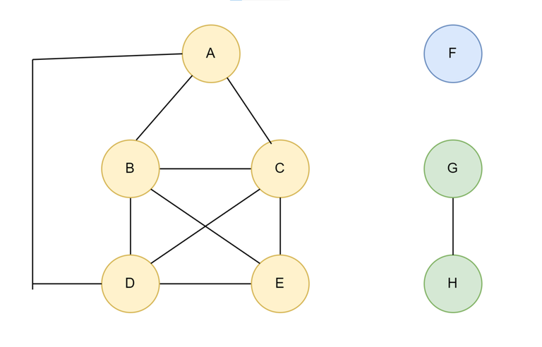
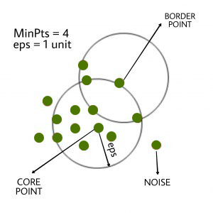
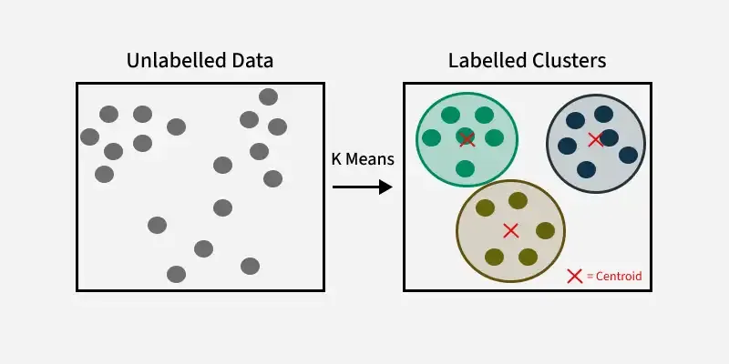

# 🗃️ Step 3: Grouping Nearby Places

# 📍 Location Clustering in Maps

### 1. 🔍 Why Clustering?

While working on map data, I stumbled upon a common challenge: **grouping locations** that are close to each other — like delivery drop points, restaurants, or traffic hotspots. That's when I discovered the magic of **clustering algorithms**. Let’s explore how Union-Find, DBSCAN, and K-Means help with location clustering in maps.

---

## 📌 i. Union-Find (Disjoint Set Union - DSU)

Union-Find is a data structure used to group elements into disjoint sets. I found it useful when locations had explicit connections (like roads or proximity thresholds), and I needed to figure out which locations formed connected clusters.

Here’s how I implemented Union-Find:

```cpp
#include <iostream>
#include <vector>
using namespace std;

class UnionFind {
    vector<int> parent;
public:
    UnionFind(int size) {
      
        parent.resize(size);
      
        // Initialize the parent array with each 
        // element as its own representative
        for (int i = 0; i < size; i++) {
            parent[i] = i;
        }
    }

    // Find the representative (root) of the
    // set that includes element i
    int find(int i) {
      
        // If i itself is root or representative
        if (parent[i] == i) {
            return i;
        }
      
        // Else recursively find the representative 
        // of the parent
        return find(parent[i]);
    }

    // Unite (merge) the set that includes element 
    // i and the set that includes element j
    void unite(int i, int j) {
      
        // Representative of set containing i
        int irep = find(i);
      
        // Representative of set containing j
        int jrep = find(j);
       
        // Make the representative of i's set
        // be the representative of j's set
        parent[irep] = jrep;
    }
};


```

# 🌍 The Algo, My Way


---

## 📌 ii. DBSCAN (Density-Based Spatial Clustering)

DBSCAN was a revelation! It clusters locations based on **density** — i.e., areas where many points are close together get grouped, and outliers are ignored. Super useful when working with noisy location data.

Here's a simplified idea in python

```python
db = DBSCAN(eps=0.3, min_samples=10).fit(X)
core_samples_mask = np.zeros_like(db.labels_, dtype=bool)
core_samples_mask[db.core_sample_indices_] = True
labels = db.labels_

# Number of clusters in labels, ignoring noise if present.
n_clusters_ = len(set(labels)) - (1 if -1 in labels else 0)

unique_labels = set(labels)
colors = ['y', 'b', 'g', 'r']
print(colors)
for k, col in zip(unique_labels, colors):
    if k == -1:
        # Black used for noise.
        col = 'k'

    class_member_mask = (labels == k)

    xy = X[class_member_mask & core_samples_mask]
    plt.plot(xy[:, 0], xy[:, 1], 'o', markerfacecolor=col,
             markeredgecolor='k',
             markersize=6)

    xy = X[class_member_mask & ~core_samples_mask]
    plt.plot(xy[:, 0], xy[:, 1], 'o', markerfacecolor=col,
             markeredgecolor='k',
             markersize=6)

plt.title('number of clusters: %d' % n_clusters_)
plt.show()


```

# 🌍 The Algo, My Way




---

## 📌 iii. K-Means Clustering

Last but not least: **K-Means**. I loved how intuitive it is — choose K centers, assign each point to the nearest one, recalculate centers, and repeat.

Here's a simple C++ demo:

```cpp
#include <iostream>
#include <vector>
#include <cmath>
#include <limits>
using namespace std;

struct Point {
    double x, y;
    int cluster = -1;
};

double distance(Point& a, Point& b) {
    return sqrt((a.x - b.x)*(a.x - b.x) + (a.y - b.y)*(a.y - b.y));
}

void kMeans(vector<Point>& points, int k, int iterations = 5) {
    vector<Point> centroids(points.begin(), points.begin() + k);

    for (int iter = 0; iter < iterations; iter++) {
        for (auto& p : points) {
            double minDist = numeric_limits<double>::max();
            for (int i = 0; i < k; i++) {
                double d = distance(p, centroids[i]);
                if (d < minDist) {
                    minDist = d;
                    p.cluster = i;
                }
            }
        }

        vector<int> count(k, 0);
        vector<double> sumX(k, 0), sumY(k, 0);

        for (auto& p : points) {
            sumX[p.cluster] += p.x;
            sumY[p.cluster] += p.y;
            count[p.cluster]++;
        }

        for (int i = 0; i < k; i++) {
            if (count[i] != 0) {
                centroids[i].x = sumX[i] / count[i];
                centroids[i].y = sumY[i] / count[i];
            }
        }
    }

    for (auto& p : points)
        cout << "Point (" << p.x << ", " << p.y << ") -> Cluster " << p.cluster << endl;
}


```

# 🌍 The Algo, My Way



---

## 🔄 Comparison Table

| Feature         | Union-Find      | DBSCAN                | K-Means              |
|----------------|------------------|------------------------|-----------------------|
| **Based on**    | Connectivity     | Density                | Distance to centroid  |
| **Handles noise**| No           |  Yes              | No                    |
| **K required?** | No              | Yes                    | Yes                   |
| **Cluster shape**| Any             | Any                    | Convex                |
| **Use case**     | Connected areas | Noisy geodata          | Structured clusters   |

---

### ✅ When to Use What?

- Use **Union-Find** when you have a network of explicit connections.
- Use **DBSCAN** when your data is noisy and density-based.
- Use **K-Means** when you know the number of clusters and want clean separation.

Location clustering feels like map magic 🔮 once you’ve played with these!
