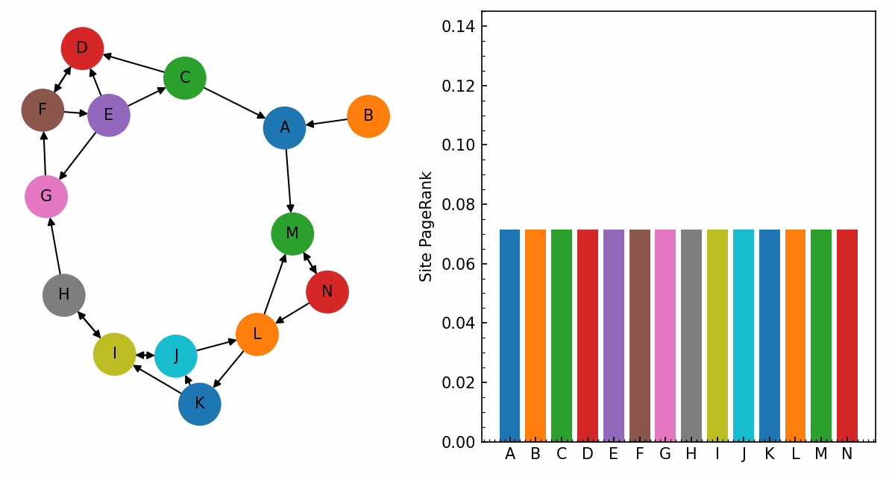

> 🧠 "Behind every seamless Google experience lies a carefully crafted algorithm."

Welcome to **Behind The Click** – a deep dive into the **algorithmic engines** powering Google’s most iconic services.

Explore how classical and modern **Data Structures and Algorithms (DSA)** bring intelligence, scalability, and lightning speed to platforms like Search, Maps, Gmail, and YouTube.

Whether you're curious about how a Trie powers Autocomplete or how PageRank works behind search results – this portfolio makes it all accessible, meaningful, and connected to reality.

---

## 🔗 Table of Contents

- [📌 Details](#-details)
- [🎯 Motivation](#-motivation)
- [🚀 Objectives](#-objectives)
- [🧮 Google Services & Algorithms](#google-services--algorithms)
- [📚 References](#references)

---

## 📌 Details

<dl>
  <dt><strong>Name</strong></dt>
  <dd>Shradha S. Kekare</dd>

  <dt><strong>USN</strong></dt>
  <dd>01fe22bcs263</dd>

  <dt><strong>Course Name</strong></dt>
  <dd>Algorithmic Problem Solving</dd>

  <dt><strong>Domain</strong></dt>
  <dd>Google Services</dd>

  <dt><strong>Course Code</strong></dt>
  <dd>23ECSE304</dd>

  <dt><strong>Faculty</strong></dt>
  <dd>Prakash Hegade</dd>

  <dt><strong>University</strong></dt>
  <dd>KLE Technological University, Hubballi-31</dd>
</dl>

## 🎯 Motivation

> Why Google? Why Algorithms?

With billions of users relying on Google every day, it's fascinating to understand how **intelligent algorithmic strategies** drive performance. This portfolio was inspired by a desire to bridge academic knowledge of **DSA** with **real-world services** we use daily.

---

## 🚀 Objectives

- 🔍 Identify and explore core Google services.
- 🔧 Highlight algorithms behind each functionality.
- 📊 Explain how those algorithms work, and why they’re efficient.
- 🌍 Link every algorithm to its real-world context.

---

## Google Services & Algorithms

Explore how Google integrates powerful algorithms behind its core services. This timeline-style format outlines how each service operates step by step, highlighting the algorithms that make them fast, scalable, and intelligent.

### 🔍 Google Search – From Query to Result

1. 🧠 Query Matching using Rabin-Karp & KMP

- ✏️ **What happens**: User enters a search query.
- 🔍 **How it works**: The query is matched using **Rabin-Karp** and **KMP**.
- 🎞️ **Watch it work**:  
   <!-- Your GIF here -->
- 📄 [See Code + Explanation](1.html)

2. ⚡ Autocomplete via Trie & TST

- ✏️ **What happens**: Autocomplete suggestions appear while typing.
- 🧠 **How it works**: Uses **Trie** and **Ternary Search Trees** for prefix matching.
- 🎞️ **Watch it work**:  
  
- 📄 [See Code + Explanation](2.html)

3. 📈 Ranking with PageRank, DFS & BFS

- ✏️ **What happens**: Relevant pages are ranked.
- 🧠 **How it works**: **PageRank**, **DFS**, and **BFS** traverse the link graph to rank pages.
- 🎞️ **Watch it work**:   
  
- 📄 [See Code + Explanation](3.html)

4. 🗂️ Caching with LRU, LFU, HashMap + DLL

- ✏️ **What happens**: Frequently accessed results are cached.
- 🧠 **How it works**: Uses **LRU**, **LFU**, and **HashMap + DLL** for quick lookups.
- 🎞️ **Watch it work**:  
  
- 📄 [See Code + Explanation](4.html)

5. ✨ Spell Correction using Levenshtein & Trigrams

- ✏️ **What happens**: Misspelled queries are auto-corrected.
- 🧠 **How it works**: Uses **Levenshtein Distance** to find closest valid words, **Trigrams** to rank them.
- 🎞️ **Watch it work**:  
  
- 📄 [See Code + Explanation](5.html)

---

## 🗺️ Google Maps – Navigating the Real World

1. 🚗 Route Finding with Dijkstra, A*, Bellman-Ford

- ✏️ **What happens**: User requests directions.
- 🧠 **How it works**: Computes shortest path using **Dijkstra’s**, **A\***, or **Bellman-Ford**.
- 🎞️ **Watch it work**:  

  
- 📄 [Details](6.html)

2. 🚦 Live Traffic Analysis with Real-time Algorithms

- ✏️ **What happens**: Traffic conditions influence route choices.
- 🧠 **How it works**: Uses **Dynamic Graphs**, **Real-time A\***, and **Floyd-Warshall** for adjustments.
- 🎞️ **Watch it work**:  
   
  
- 📄 [Details](7.html)

3. 📍 Clustering Nearby Places

- ✏️ **What happens**: Nearby places are grouped.
- 🧠 **How it works**: Clustering with **Union-Find**, **DBSCAN**, or **K-Means**.
- 🎞️ **Watch it work**:  
  _Animated GIF showing nearby points being grouped into clusters._  
  
- 📄 [Details](8.html)

4. 🗺️ Spatial Mapping with Convex Hull & K-D Trees

- ✏️ **What happens**: Regional boundaries are computed.
- 🧠 **How it works**: Uses **Convex Hull (Graham Scan)** and **K-D Trees**.
- 🎞️ **Watch it work**:  
  _GIF showing region boundaries forming around geo-points._  
  
- 📄 [Details](9.html)

---

## 📧 Gmail – Smarter Email Management

1. 🧵 Threading Emails with Union-Find

- ✏️ **What happens**: Emails are grouped into threads.
- 🧠 **How it works**: Uses **Disjoint Sets**, **Union-Find**, and **Hash Maps**.
- 🎞️ **Watch it work**:  
  
  
- 📄 [Details](10.html)

2. 💾 Caching Frequently Accessed Emails

- ✏️ **What happens**: Frequently opened emails are cached.
- 🧠 **How it works**: Caching via **LRU**, **LFU**, and **ARC** strategies.
- 🎞️ **Watch it Work**:  
 
  
- 📄 [Details](11.html)

3. 📎 Compressing Attachments with Huffman Coding

- ✏️ **What happens**: Attachments are compressed for storage.
- 🧠 **How it works**: Compression using **Huffman Coding**.
- 🎞️ **Watch it work**:  

  
- 📄 [Details](12.html)

4. 🔎 Fast Mail Search with Inverted Index

- ✏️ **What happens**: Searching across your inbox.
- 🧠 **How it works**: Uses an **Inverted Index** for fast keyword lookups.
- 🎞️ **Watch it work**:  

  
- 📄 [Details](13.html)

---

## 📺 YouTube – Organizing the Video World

1. 🗂️ Video Indexing using Suffix Trees

- ✏️ **What happens**: Videos are indexed for search and recommendations.
- 🧠 **How it works**: Structures like **Suffix Trees** and **Inverted Index** are used.
- 🎞️ **Watchit work**:  

  
- 📄 [Details](14.html)

2. 🔍 Metadata Search using Suffix Arrays & KMP

- ✏️ **What happens**: User searches for videos.
- 🧠 **How it works**: Matches metadata using **Suffix Arrays** and **KMP**.
- 🎞️ **Watch it work**:  

  
- 📄 [Details](15.html)

3. 📊 Detecting Trends via Sliding Window

- ✏️ **What happens**: Trending content is surfaced.
- 🧠 **How it works**: Detected with **Sliding Window** and **Heap Counters**.
- 🎞️ **Watch it work**:  

  
- 📄 [Details](16.html)

4. 🗜️ Video Compression Techniques

- ✏️ **What happens**: Videos are compressed for storage efficiency.
- 🧠 **How it works**: Uses **Huffman**, **Arithmetic**, and **Run-Length Encoding**.
- 🎞️ **Watch it work**:  
  
  
- 📄 [Details](17.html)

---

## 📆 Google Calendar – Scheduling Smarter

1. 🗓️ Event Sorting with Classic Sort Algorithms

- ✏️ **What happens**: Events are sorted chronologically.
- 🧠 **How it works**: Uses **Merge Sort**, **Quick Sort**, or **Heap Sort**.
- 🎞️ **Watch it work**:  
 
  
- 📄 [Details](18.html)

2. ⏳ Availability Checking via Interval Search

- ✏️ **What happens**: System checks for free time slots.
- 🧠 **How it works**: Uses **Binary Search**, **Sparse Tables**, and **Segment Trees**.
- 🎞️ **Watch it work**:  

  
- 📄 [Details](19.html)

3. ⏰ Reminders via Priority Queues

- ✏️ **What happens**: Reminders pop up before events.
- 🧠 **How it works**: Uses **Priority Queues**, **Min-Heaps**, and **Time Wheels**.
- 🎞️ **Watch it work**:  

  
- 📄 [Details](20.html)

---

## References

- [GeeksforGeeks](https://www.geeksforgeeks.org/)  
- Wikipedia: Dijkstra, Trie, Hashing  
- Stack Overflow Discussions

> 📌 This  portfolio outlines the key **Data Structures and Algorithms (DSA)** behind Google’s services, providing insight into real-world applications of theoretical concepts.

