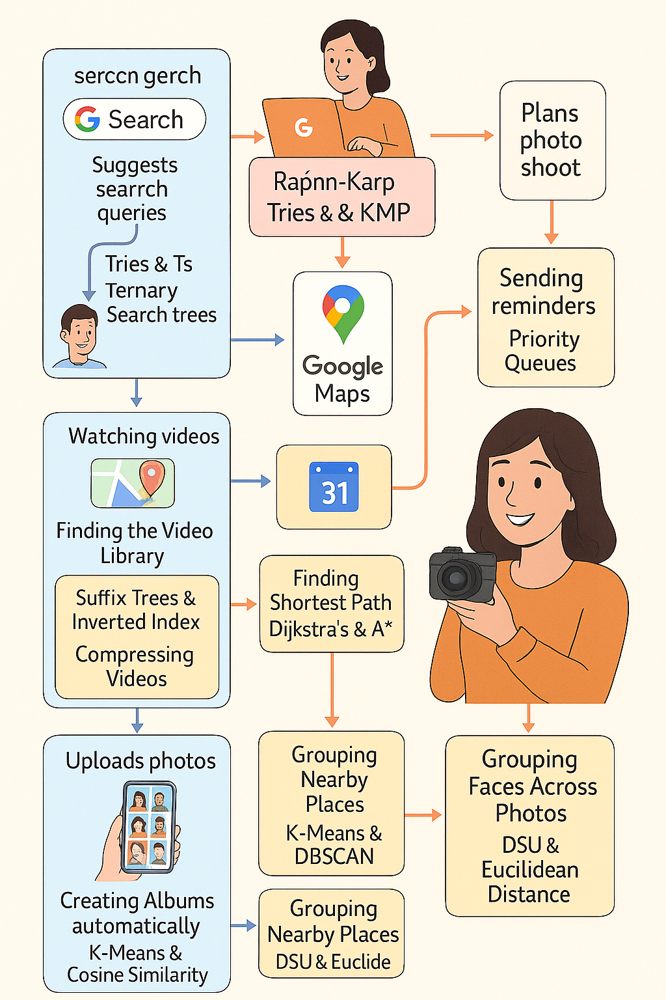
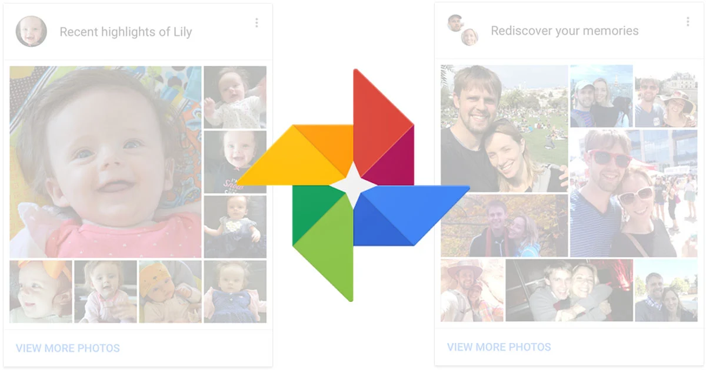

  🧠 “Every tap on a Google service triggers a chain of finely-tuned algorithms — it’s time to uncover what clicks behind the click.”

Welcome to Behind The Click — a curated exploration of the algorithmic blueprints driving Google's smartest features.

From the instant results of Search to the route optimizations in Maps, this portfolio connects everyday experiences with the data structures and algorithms behind them. It's not just about theory — it's about understanding how real-world systems are built.

---

# 📌 Details

<dl>
  <dt><strong>Name</strong></dt>
  <dd>Shradha S. Kekare</dd>

  <dt><strong>USN</strong></dt>
  <dd>01fe22bcs263</dd>

  <dt><strong>Course Name</strong></dt>
  <dd>Algorithmic Problem Solving</dd>

  <dt><strong>Domain</strong></dt>
  <dd>Google Services</dd>

  <dt><strong>Course Code</strong></dt>
  <dd>23ECSE309</dd>

  <dt><strong>Faculty</strong></dt>
  <dd>Prakash Hegade</dd>

  <dt><strong>University</strong></dt>
  <dd>KLE Technological University, Hubballi-31</dd>
  
  <dt><strong>Email</strong></dt>
  <dd>kenkreshraddha92@gmail.com</dd>
</dl>

  

---

# 🚀 Google Services & Algorithms

Explore how Google integrates powerful algorithms behind its core services. This timeline-style format outlines how each service operates step by step, highlighting the algorithms that make them fast, scalable, and intelligent.

---

# 🌟 A Day in the Googleverse — The Story

> It starts with a search. A curious morning thought leads you to Google. That one phrase — typed in seconds — triggers trillions of instructions. From instant recommendations in YouTube to live traffic updates on Maps, Google becomes your silent co-pilot.  
>  
> As the day unfolds, you swipe through old photos, respond to a Calendar notification, and take a shortcut thanks to Maps’ clever rerouting. It feels seamless. But behind every feature lies a symphony of intelligent data structures and algorithms — working tirelessly to anticipate your needs.
>  
> Welcome to your day, powered by code.

  

---

# 🧪 Case Study: How Google Search Delivers the Perfect Result

### 🔍 Scenario: A User Searches for "Best DSLR Cameras"

> On a regular morning, a user types "Best DSLR Cameras for Beginners" into Google. Within milliseconds, Google presents hundreds of relevant, ranked, and refined results. But what’s happening behind the scenes?

### [🛠️ Step 1: String Matching Begins](1.html)
- **Why KMP/Rabin-Karp?**  
  Fast and scalable substring matching by avoiding re-checking characters.

### [🧠 Step 2: Autocomplete Kicks In](2.html)
- **Why Tries?**  
  Lookup time is reduced to O(L), where L is the length of the prefix.

### [📈 Step 3: Page Ranking Magic](3.html)
- **Why Graph Algorithms?**  
  They evaluate importance based on the number and quality of inbound links.

### [💾 Step 4: Caching for Speed](4.html)
- **Why Caching?**  
  To serve common queries in constant time.

### [📝 Step 5: Handling Typos](5.html)
- **Why Edit Distance?**  
  Finds the most likely intended query using minimal edits.

# ✅ Final Outcome
- Accurate search results  
- Helpful auto-suggestions  
- Corrected spellings  
- Fast load times due to caching

> 🔎 **Summary**: Google Search isn’t just a black box—it’s a beautifully choreographed system where **graphs**, **tries**, **DP**, and **greedy logic** blend to serve billions daily.

---

# 🧪 Case Study: How Google Maps Gets You There (Fast)

### 🗺️ Scenario: A User Navigates to a Café in Traffic in Hubballi

> A user opens Google Maps and searches for the quickest route to their favorite café. Maps instantly shows directions, live traffic, and nearby recommendations. What powers this magic?

### [🛠️ Step 1: Finding the Shortest Path](6.html)
- **Why Shortest Path Algorithms?**  
  They identify the fastest or shortest route through a weighted road network.

### [🧠 Step 2: Live Traffic Integration](7.html)
- **Why Dynamic Graphs?**  
  They reflect changes in traffic conditions on the fly.

### [🗃️ Step 3: Grouping Nearby Places](8.html)
- **Why Clustering?**  
  Clusters make map exploration simpler and faster for users.

### [📍 Step 4: Mapping Regional Boundaries](9.html)
- **Why Spatial Structures?**  
  Help in rendering fast and accurate region outlines.

# ✅ Final Outcome
- Optimal route suggestions  
- Real-time traffic-aware updates  
- Grouped POIs  
- Seamless regional overlays

> 🔎 **Summary**: Google Maps uses graph algorithms, clustering techniques, and spatial structures to deliver real-time navigation.

---

# 🧪 Case Study: How YouTube Organizes the Video World

### 🎬 Scenario: A User Searches for a binary search tree video on YouTube

> A user searches for a trending short. YouTube instantly retrieves it and suggests others. What enables this seamless video discovery?

### [🛠️ Step 1: Indexing the Video Library](10.html)
- **Why Suffix Structures?**  
  They enable fast pattern lookups and partial match searches.

### [🧠 Step 2: Searching for Videos](11.html)
- **Why Suffix Arrays?**  
  They support quick searches in large text datasets.

### [📈 Step 3: Detecting Trending Content](12.html)
- **Why Sliding Windows?**  
  They detect spikes in short periods to capture trends early.

### [💾 Step 4: Compressing Videos](13.html)
- **Why Compression?**  
  It saves bandwidth and improves playback performance.

# ✅ Final Outcome
- Exact and relevant video results  
- Trending content in real-time  
- Compressed storage for smooth playback

> 🔎 **Summary**: YouTube blends pattern matching, trend detection, and compression for a scalable video experience.

---

# 🧪 Case Study: How Google Calendar Keeps You Organized

### 🕒 Scenario: A User Schedules a Meeting Without Conflicts

> A user adds a meeting and sets a recurring schedule. Calendar handles overlaps, timing, and reminders flawlessly.

### [🛠️ Step 1: Storing and Sorting Events](14.html)
- **Why Sorting?**  
  Sorted events are easier to display and detect clashes.

### [🧠 Step 2: Checking Availability](15.html)
- **Why Interval Search?**  
  Efficient for checking overlapping time slots.

### [⏰ Step 3: Sending Reminders](16.html)
- **Why Scheduling Structures?**  
  Ensure timely delivery of alerts and popups.

### [🔁 Step 4: Managing Recurring Events](17.html)
- **Why Linked Structures?**  
  Efficient for traversing repeating patterns in schedules.

# ✅ Final Outcome
- Non-overlapping events  
- Timely alerts  
- Seamless recurring schedules

> 🔎 **Summary**: Google Calendar uses sorting, trees, and priority queues to automate planning.

---

# 📸 Up Next... A Trip Down Memory Lane

> From organizing meetings to organizing memories — Google’s next trick is just as magical.  
>  
> Ever wondered how your photos get grouped by faces, dates, or even places? 🤔  
>  
> Stay tuned for the next case study — where we dive into the **smart structures behind Google Photos** and how it keeps your memories sorted, compressed, and ready for nostalgia.

  

> 📍 *Coming up next: The unseen algorithms that recognize smiles, sort albums, and fight duplicates so you don’t have to.*

----
> 📘 **APS Takeaways — From Classrooms to Clicks**  
> *“Every algorithm I learned in class found its real-world echo in this portfolio.”*

APS (Algorithmic Problem Solving) wasn’t just a subject — it was the lens through which I decoded how Google works behind the scenes. Here's how the topics taught by **Prakash Hegade Sir** helped me shape this interactive portfolio:

### 🔁 Dynamic Programming  
From YouTube’s video trend detection (using **sliding window** logic) to typo handling in Google Search (**edit distance**), dynamic programming helped break complex problems into simpler subproblems — just as we practiced in class.

### 🌐 PageRank  
One of the highlights of APS was the PageRank algorithm. In my portfolio’s Search section, I explored how **PageRank scores** determine which pages rise to the top — exactly how Google started. Understanding this from both a theoretical and applied angle was powerful.

### 🌟 Range Queries & Sparse Table  
In Google Photos, I drew inspiration from **sparse table** and **lookup tables** for tasks like timeline arrangement and photo grouping — connecting back to the range query optimizations we covered in class.

### 🚦A* and Pathfinding  
The shortest path algorithms behind Google Maps felt familiar thanks to APS. Techniques like **Dijkstra** and **A*** enabled me to explain how live route optimization is done under the hood.

### 📊 Mo's Algorithm  
While not explicitly visualized, the concept of **offline query optimization** inspired me to think about query batching — especially in scenarios like video indexing or face matching across photos in Google Photos.

---

> 💡 **APS helped me look at the world not just through code — but through logic.**  
> This portfolio is a direct outcome of that journey: from solving coding problems on paper to understanding how world-class systems like Google are built — one algorithm at a time.

# 📚 References

- [GeeksforGeeks – Data Structures & Algorithms](https://www.geeksforgeeks.org/data-structures/)
- [Wikipedia – Dijkstra's Algorithm](https://en.wikipedia.org/wiki/Dijkstra%27s_algorithm)
- [Wikipedia – Trie Data Structure](https://en.wikipedia.org/wiki/Trie)
- [Wikipedia – Rabin–Karp Algorithm](https://en.wikipedia.org/wiki/Rabin%E2%80%93Karp_algorithm)
- [Wikipedia – PageRank](https://en.wikipedia.org/wiki/PageRank)
- [Wikipedia – Suffix Array](https://en.wikipedia.org/wiki/Suffix_array)
- [Wikipedia – Sliding Window Technique](https://en.wikipedia.org/wiki/Sliding_window_protocol)
- [Wikipedia – Edit Distance](https://en.wikipedia.org/wiki/Edit_distance)
- [Wikipedia – Hash Function](https://en.wikipedia.org/wiki/Hash_function)
- [Wikipedia – Graph Traversal](https://en.wikipedia.org/wiki/Graph_traversal)
- [Stack Overflow – Differences between DFS and BFS](https://stackoverflow.com/questions/3336537/what-is-the-difference-between-depth-first-and-breadth-first-search)
- [MIT OpenCourseWare – Graph Algorithms](https://ocw.mit.edu/courses/electrical-engineering-and-computer-science/6-006-introduction-to-algorithms-fall-2011/lecture-videos/lecture-13-dfs-topological-sort/)
- [OpenCV Documentation – Computer Vision Library](https://docs.opencv.org/)
- [Wikipedia – Convolutional Neural Networks](https://en.wikipedia.org/wiki/Convolutional_neural_network)
- [Wikipedia – Clustering Algorithms](https://en.wikipedia.org/wiki/Cluster_analysis)
- [Google AI Blog](https://ai.googleblog.com/)
- [Towards Data Science – Machine Learning Tutorials](https://towardsdatascience.com/)
- [Scikit-learn – Machine Learning in Python](https://scikit-learn.org/stable/)
- [Wikipedia – K-Means Clustering](https://en.wikipedia.org/wiki/K-means_clustering)
- [Wikipedia – Image Segmentation](https://en.wikipedia.org/wiki/Image_segmentation)

> 📌 This portfolio outlines the key **Data Structures and Algorithms (DSA)** behind Google’s services, providing insight into real-world applications of theoretical concepts.
