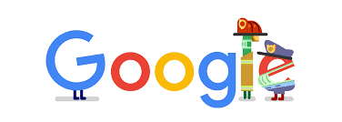

  🧠 “Every tap on a Google service triggers a chain of finely-tuned algorithms — it’s time to uncover what clicks behind the click.”

Welcome to **Behind The Click** — a curated exploration of the **algorithmic blueprints** driving Google's smartest features.

From the instant results of Search to the route optimizations in Maps, this portfolio connects everyday experiences with the **data structures and algorithms** behind them. It's not just about theory — it's about **understanding how real-world systems are built**.

Whether you're intrigued by how a Trie enables Autocomplete or how Segment Trees avoid calendar overlaps, this collection bridges intuition with implementation in the most engaging way.

---

## 📌 Details

<dl>
  <dt><strong>Name</strong></dt>
  <dd>Shradha S. Kekare</dd>

  <dt><strong>USN</strong></dt>
  <dd>01fe22bcs263</dd>

  <dt><strong>Course Name</strong></dt>
  <dd>Algorithmic Problem Solving</dd>

  <dt><strong>Domain</strong></dt>
  <dd>Google Services</dd>

  <dt><strong>Course Code</strong></dt>
  <dd>23ECSE304</dd>

  <dt><strong>Faculty</strong></dt>
  <dd>Prakash Hegade</dd>

  <dt><strong>University</strong></dt>
  <dd>KLE Technological University, Hubballi-31</dd>
</dl>

  

---

## Google Services & Algorithms

Explore how Google integrates powerful algorithms behind its core services. This timeline-style format outlines how each service operates step by step, highlighting the algorithms that make them fast, scalable, and intelligent.

### 🧪 Case Study: How Google Search Delivers the Perfect Result

#### 🔍 Scenario: A User Searches for "Best DSLR Cameras"

> On a regular morning, a user types "Best DSLR Cameras for Beginners" into Google. Within milliseconds, Google presents hundreds of relevant, ranked, and refined results. But what’s happening behind the scenes?

---

#### 🛠️ Step 1: String Matching Begins

To match the query to documents, **Rabin-Karp** and **KMP** algorithms are applied for efficient pattern searching across billions of indexed web pages.  
📄 [Details](1.html)

- 📌 **Why KMP/Rabin-Karp?**  
  These algorithms offer fast and scalable substring matching by avoiding re-checking characters.

---

#### 🧠 Step 2: Autocomplete Kicks In

Before the user even finishes typing, suggestions like *"Best DSLR Cameras 2025"* pop up—thanks to **Trie** and **Ternary Search Trees** enabling prefix-based lookups in real-time.  
📄 [Details](2.html)

- 📌 **Why Tries?**  
  Tries reduce lookup time to O(L), where L is the length of the prefix.

---

#### 📈 Step 3: Page Ranking Magic

Once results are fetched, they’re sorted using **PageRank**, combined with **DFS** and **BFS** to traverse the web’s graph of interconnected pages.  
📄 [Details](3.html)

- 📌 **Why Graph Algorithms?**  
  They help evaluate importance based on the number and quality of inbound links.

---

#### 💾 Step 4: Caching for Speed

Frequently visited search results are retrieved from **LRU**, **LFU**, or **HashMap + DLL** caches, improving speed and reducing recomputation.  
📄 [Details](4.html)

- 📌 **Why Caching?**  
  To serve common queries in constant time.

---

#### 📝 Step 5: Handling Typos

If the user accidentally types "Best DSLF Cameraz", Google's spell checker steps in using **Levenshtein Distance** and **Trigram Matching** to suggest "Best DSLR Cameras".  
📄 [Details](5.html)

- 📌 **Why Edit Distance?**  
  It helps find the most likely intended query based on minimal edits.

---

#### ✅ Final Outcome:

In under 0.3 seconds, the user sees:
- Accurate search results  
- Helpful auto-suggestions  
- Corrected spellings  
- Fast load times due to caching  

---

> 🔎 **Summary**: Google Search isn’t just a black box—it’s a beautifully choreographed system where **graphs**, **tries**, **DP**, and **greedy logic** blend to serve billions daily.

### 🧪 Case Study: How Google Maps Gets You There (Fast)

#### 🗺️ Scenario: A User Navigates to a Café in Traffic in Hubballi

> It’s a busy Monday. A user opens Google Maps and searches for the quickest route to their favorite café. Maps instantly shows directions, live traffic, and nearby recommendations. But what powers this magic?

---

#### 🧭 Step 1: Finding the Shortest Path

As soon as the destination is selected, Google Maps computes the **fastest route** using algorithms like **Dijkstra’s**, **A\***, and **Bellman-Ford**.  
📄 [Details](6.html)

- 📌 **Why These Algorithms?**  
  - **Dijkstra’s**: Efficient for positive-weight roads.  
  - **A\***: Adds heuristics for faster routing.  
  - **Bellman-Ford**: Handles graphs with negative weights (less common, but useful in traffic prediction).

---

#### 🚦 Step 2: Live Traffic Integration

While calculating the route, Maps considers **real-time congestion** using **Dynamic Graphs** and **Real-Time A\*** updates.  
📄 [Details](7.html)

- 📌 **How It Works:**  
  - Traffic updates change edge weights dynamically.  
  - **Floyd-Warshall** helps in static all-pairs path precomputation for quick rerouting.

---

#### 🗃️ Step 3: Grouping Nearby Places

Looking for coffee shops or ATMs nearby? Maps uses **clustering** to group similar points of interest.  
📄 [Details](8.html)

- 🧠 Algorithms at Play:  
  - **Union-Find (DSU)**: For spatial grouping.  
  - **DBSCAN**: Density-based clustering (no need to predefine clusters).  
  - **K-Means**: Location-based grouping.

---

#### 📍 Step 4: Regional Mapping and Boundaries

Zooming in shows neighborhood outlines, park boundaries, or lake contours—crafted using **Convex Hull** and **K-D Trees**.  
📄 [Details](9.html)

- 📌 **Why These Structures?**  
  - **Convex Hull (Graham Scan)** outlines the outer boundary of locations.  
  - **K-D Trees** enable fast spatial queries like "Find the 5 nearest places".

---

#### ✅ Final Outcome:

Within seconds, the user gets:
- Optimal route suggestions  
- Real-time traffic-aware updates  
- Grouped POIs for discovery  
- Seamless regional map overlays  

---
> 🔎 **Summary**:  Google Maps uses classic graph algorithms, clustering techniques, and spatial data structures to deliver real-time, intelligent navigation experiences.
---

### 📺 Case Study: How YouTube Organizes the Video World

#### 🎬 Scenario: A User Searches for a Trending Video on YouTube

> A user wants to rewatch a trending short. They search for it by keyword, and YouTube instantly retrieves it with high accuracy — also suggesting other trending content. What enables this seamless video discovery?

---

#### 📥 Step 1: Indexing the Video Library

YouTube pre-processes video titles, tags, and descriptions to make them easily searchable using:  
📄 [Details](10.html)

- 📌 **Structures Used:**  
  - **Suffix Trees**: For fast substring matches in metadata.  
  - **Inverted Index**: For mapping words to a list of relevant videos.

---

#### 🔎 Step 2: Searching for Videos

When a user types a query, YouTube matches it efficiently using:  
📄 [Details](11.html)

- 📌 **Algorithms in Action:**  
  - **Suffix Arrays**: For quick lexicographic search.  
  - **KMP Algorithm**: For pattern matching within titles and tags.

---

#### 📈 Step 3: Detecting Trending Content

To surface viral videos in real-time, YouTube uses dynamic monitoring tools.  
📄 [Details](12.html)

- 📌 **Key Techniques:**  
  - **Sliding Window**: Tracks view spikes over recent intervals.  
  - **Heap-based Counters**: Maintains top-viewed content efficiently.

---

#### 💾 Step 4: Compressing Videos for Storage

Billions of hours of video require smart storage using compression techniques.  
📄 [Details](13.html)

- 📌 **Encoding Methods:**  
  - **Huffman Coding**  
  - **Arithmetic Coding**  
  - **Run-Length Encoding (RLE)**

---

#### ✅ Final Outcome:

The user quickly finds:
- Exact and relevant video results  
- Real-time trending content  
- Smooth playback with compressed storage  

---
> 🔎 Summary: YouTube blends pattern matching, trend detection, and data compression to deliver fast, scalable video experiences.

---

### 📆 Case Study: How Google Calendar Keeps You Organized

#### 🕒 Scenario: A User Schedules a Meeting Without Conflicts

> It’s Friday evening. A user adds a meeting, sets a recurring schedule, and wants reminders — all without overlaps. Google Calendar handles it like a pro. What powers this planner?

---

#### 📋 Step 1: Storing and Sorting Events

When events are created, Calendar ensures they are correctly ordered.  
📄 [Details](14.html)

- 📌 **Sorting Tools:**  
  - **Merge Sort**, **Quick Sort**, **Heap Sort**

---

#### 🔍 Step 2: Checking Availability

Before finalizing, Calendar checks for schedule clashes using:  
📄 [Details](14.html)

- 📌 **Conflict Detection Structures:**  
  - **Binary Search**  
  - **Segment Trees**  
  - **Sparse Tables**

---

#### ⏰ Step 3: Sending Reminders

Alerts are sent at the right time using efficient timers.  
📄 [Details](15.html)

- 📌 **Reminder Scheduling:**  
  - **Priority Queues**  
  - **Min-Heaps**  
  - **Time Wheels**

---

#### 🔁 Step 4: Managing Recurring Events

Repeating events like weekly check-ins are tracked using:  
📄 [Details](16.html)

- 📌 **Data Structures Used:**  
  - **Linked Lists**  
  - **Hash Maps**  
  - **Floyd’s Cycle Detection**

---

#### ✅ Final Outcome:

In seconds, the user gets:
- Non-overlapping events  
- Timely alerts  
- Effortless recurring scheduling  

---
> 🔎 Summary: Google Calendar uses classic sorting, interval trees, and reminder queues to automate your scheduling life.

---

### 📸 Case Study: How Google Photos Keeps Memories Organized

#### 🖼️ Scenario: A User Uploads Vacation Photos and Sees Auto-Albums and Face Tags

> A user uploads a set of vacation photos. Google Photos detects duplicates, sorts by timeline, auto-tags faces, and builds albums. How does it all happen so fast?

---

#### 🗑️ Step 1: Detecting Duplicate Photos

Photos are compared and cleaned using:  
📄 [Details](17.html)

- 📌 **Key Techniques:**  
  - **Hash Tables**  
  - **Bloom Filters**  
  - **Hamming Distance**

---

#### 🗂️ Step 2: Creating Albums Automatically

Photos are grouped into intelligent albums using clustering.  
📄 [Details](18.html)

- 📌 **Clustering Tools:**  
  - **K-Means**  
  - **DBSCAN**  
  - **Cosine Similarity**  
  - **Metadata Trees**

---

#### 🕒 Step 3: Arranging Timeline View

The gallery is organized by time using smart sorting.  
📄 [Details](19.html)

- 📌 **Sorting Algorithms:**  
  - **Radix Sort**  
  - **Bucket Sort**  
  - **Min-Heaps**  
  - **Balanced BSTs**

---

#### 👥 Step 4: Grouping Faces Across Photos

Facial recognition is modeled as a graph problem.  
📄 [Details](20.html)

- 📌 **Graph Approach:**  
  - **DSU (Disjoint Set Union)**  
  - **Euclidean Distance**  
  - **Connected Components**

---

#### ✅ Final Outcome:

User sees:
- Cleaned photo collections  
- Auto-grouped memories  
- Timeline and face-wise navigation  

---
> 🔎 Summary: Google Photos merges clustering, hashing, and graph algorithms to make photo organization feel like magic.

 

## References

- [GeeksforGeeks](https://www.geeksforgeeks.org/)  
- Wikipedia: Dijkstra, Trie, Hashing  
- Stack Overflow Discussions

> 📌 This  portfolio outlines the key **Data Structures and Algorithms (DSA)** behind Google’s services, providing insight into real-world applications of theoretical concepts.

